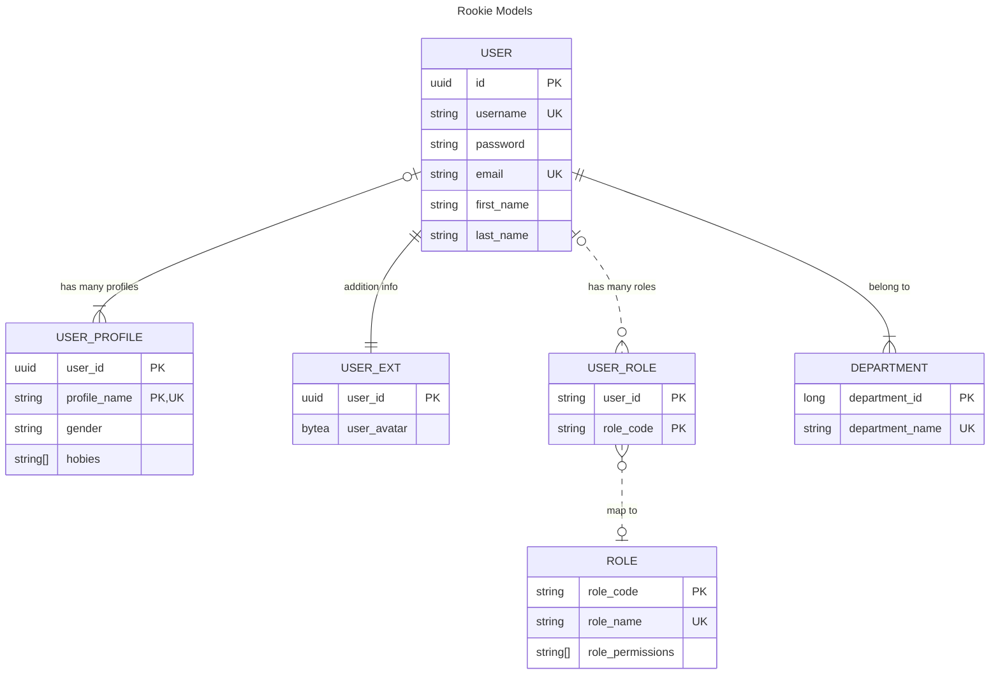

Entity Model

```mermaid
---
title: Rookie Models
---
erDiagram
    USER |o--|{ USER_PROFILE : "has many profiles"
    USER {
        uuid id PK
        string username UK
        string password
        string email UK
        string first_name
        string last_name
    }
    USER_PROFILE {
        uuid user_id PK
        string profile_name PK, UK
        string gender
        string[] hobies
        
    }
    USER ||--|| USER_EXT : "addition info"
    USER_EXT {
        uuid user_id PK
        bytea user_avatar
    }
    USER |o..o{ USER_ROLE: "has many roles"
    USER_ROLE {
        string user_id PK
        string role_code PK
    }
    USER_ROLE }o..o| ROLE: "map to"  
    ROLE {
        string role_code PK
        string role_name UK
        string[] role_permissions
    }
    USER ||--|{ DEPARTMENT : "belong to"
    DEPARTMENT {
        long department_id PK
        string department_name UK
    }
```

Links
[n+1 Query Problem](https://blog.nimbleways.com/using-entitygraphs-to-solve-n-1-query-problem/)